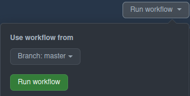

# FreeCAD Snap Documentation

## How to make a new stable release

  * Create a PR that updates the `snap/snapcraft.yaml` file (see https://github.com/FreeCAD/FreeCAD-snap/pull/75 for example) and merge it to the stable branch
  **Result:** Once merged this will build a **candidate** release.
  * Test the 'candidate' release. If no issues present then...
  * Login to https://snapcraft.io/freecad/releases and promote the **candidate** release to **stable**
  **Result:** Stable will now be the latest stable branch

## How to update the Snap store credentials

This must be done once per year by someone with Maintainer access to this repo and the Snap Store login credentials. As of this writing, those people are @yorik, @luzpaz, and @chennes. On a Linux command line with `snapcraft` installed, generate new credentials with:
```
snapcraft export-login <credentials-filename>
```
Copy the contents of this file to the clipboard and go to the [FreeCAD-snap GitHub secrets page](https://github.com/FreeCAD/FreeCAD-snap/settings/secrets/actions). Edit the STORE_LOGIN secret to be the contents of the generated key.

## How to add snap-specific workarounds or changes

Edit [snap/local/snap-setup-mod/Init.py](https://github.com/FreeCAD/FreeCAD-snap/blob/master/snap/local/snap-setup-mod/Init.py), which is called on every start of FreeCAD.

E.g.

```python
def configure_mod_raytracing():
  import FreeCAD
  param = FreeCAD.ParamGet("User parameter:BaseApp/Preferences/Mod/Raytracing")
  if not param.GetString("PovrayExecutable", ""):
    param.SetString("PovrayExecutable", "/snap/freecad/current/usr/bin/povray")

configure_mod_raytracing()
```

This automatically sets the `PovrayExecutable` parameter to the correct path inside the snap.

**Convention**: One function per workbench, don't overwrite the user's settings.

## Publishing Daily

The github action called 'Publish Daily' is an automated process that is triggered every evening to publish a new 'edge' build. It can also be triggered manually to build on-demand.



In the screenshot above clicking the 'Run workflow' button will open a dialog with 2 buttons:

The `Branch:` button indicates what branch of FreeCAD-snap you'd like to trigger. Default is 'master'.

The green `Run workflow` button actually triggers the build to start. Once this is clicked, the build takes whatever time it takes to build FreeCAD from source and then push the new build to the 'edge' channel. After that all the user has to do is `snap refresh` and the latest 'edge' will auto-download to their machine


## Parallel Installs

Running multiple snaps AKA 'Parallel Installs' (parallel but separate).

By default, snap packages that have several 'channels' will share configs between them. For testing purposes sometimes this isn't wanted, the solution per the snapcraft docs is using the [parallel install](https://snapcraft.io/docs/parallel-installs) feature.

> Parallel installs enable you to run multiple instances of the same snap on the same system. Each instance is completely isolated from all other instances, including its name, configuration, interface connections, data locations, services, applications and aliases.

Note: at the time of writing this the parallel install feature is still considered experimental

In the context of FreeCAD, this feature would be useful for example if there are experimental changes (in an experimental build) to the FreeCAD config files that could corrupt the snap stable or snap edge channel FreeCAD config files.

Example: Install edge snap in parallel to the stable snap

```shell
# Enable experimental parallel instances feature
$ sudo snap set system experimental.parallel-instances=true
# Install freecad snap from channel edge as 'freecad_edge'
$ sudo snap install freecad_edge --channel=edge
# run FreeCAD from this parallel install
$ freecad_edge
```

## Build snaps from FreeCAD branches or forks

It is possible to build snaps from any branch of fork of the FreeCAD repository. This option is also open to outside users that can simply make a PR to trigger and re-trigger a build.

1. Fork the FreeCAD-snap repo.
1. Create a new branch to work on.
1. Open *[snap/snapcraft.yaml](./snap/snapcraft.yaml)* in a text editor
1. Locate the `freecad` block of the yaml file
1. Modify the `source:` variable to reflect the specific fork of FreeCAD master to build. Note: must end with `.git` extension.
1. Add a  `source-branch:` variable to indicate what specific branch of said fork to build.  In the **example below** is a before and after in which we're building a snap of user @WandererFan's `hlrThreadrc1` branch from his FreeCAD clone ([borrowed from actual example](https://github.com/FreeCAD/FreeCAD-snap/pull/44)):
    ```yaml
     freecad:
      plugin: cmake
      source: https://github.com/FreeCAD/FreeCAD.git
    ```
    ```yaml
      freecad:
       plugin: cmake
       source: https://github.com/WandererFan/FreeCAD.git
       source-branch: hlrThreadrc1
1. Save the `snap/snapcraft.yaml` changes to the branch and make Pull Request to FreeCAD-snap.
1. Ask a maintainer to assign the https://github.com/FreeCAD/FreeCAD-snap/labels/safe%20to%20publish tag to the PR.
1. Result: the snap should build and output 'Installation Instructions'.
1. PR should be closed when said experimental snap builds aren't further necessary.
1. **Important note:** each commit to the branch will need a manual retrigger in order to re-build the snap. See below:

### Triggering re-builds

As mentioned above, new commits to a branch will not retrigger the rebuilding of a snap. It needs to be done manually.
1. Open the same `snap/snapcraft.yaml` above
1. Find the `environment:` block
1. Add `BUILD_ME: 1` to the end of the block
1. Push change to the open PR
1. Note: To retrigger, iterate `BUILD_ME:`.
    ```yaml
    environment:
      LD_LIBRARY_PATH: $SNAP/usr/lib/   $SNAPCRAFT_ARCH_TRIPLET/blas:$SNAP/usr/lib/   $SNAPCRAFT_ARCH_TRIPLET/lapack # numpy
      LD_PRELOAD: $SNAP/usr/lib/    $SNAPCRAFT_ARCH_TRIPLET/libstubchown.so
      ...
      ...
      ...
      POVINI: $SNAP/etc/povray/3.7/povray.ini #     Raytracing
    ```

    ```yaml
      environment:
      LD_LIBRARY_PATH: $SNAP/usr/lib/   $SNAPCRAFT_ARCH_TRIPLET/blas:$SNAP/usr/lib/   $SNAPCRAFT_ARCH_TRIPLET/lapack # numpy
      LD_PRELOAD: $SNAP/usr/lib/    $SNAPCRAFT_ARCH_TRIPLET/libstubchown.so
      ...
      ...
      ...
      POVINI: $SNAP/etc/povray/3.7/povray.ini #     Raytracing
      BUILD_ME: 1
      ```
1. When task is complete and no more snap builds are needed, simply close the PR and delete the branch.

See example https://github.com/FreeCAD/FreeCAD-snap/pull/44

## Updating KDE Frameworks version

Every so often it is necessary to update the KDE Frameworks. See https://github.com/FreeCAD/FreeCAD-snap/pull/80.

This is related to the `kde-neon` extension, read the official documentation (may be outdated) https://snapcraft.io/docs/kde-neon-extension.

## Checking if a 3rd party depedency is available

Different package ecosystems name their dependencies differently.
Questions:
1. Where does Snap pull dependencies from ?
2. How does one query to ascertain the correct name of the dependency ?

Answers:
1. Dependencies are listed using their apt package names and are retrieved from the set of repositories officially supported by the distribution (make sure you pulling an apt package for the correct distro version that the snap packaging is utilizing).
2. https://packages.ubuntu.com (it may be beneficial to cross-reference https://repology.org)
